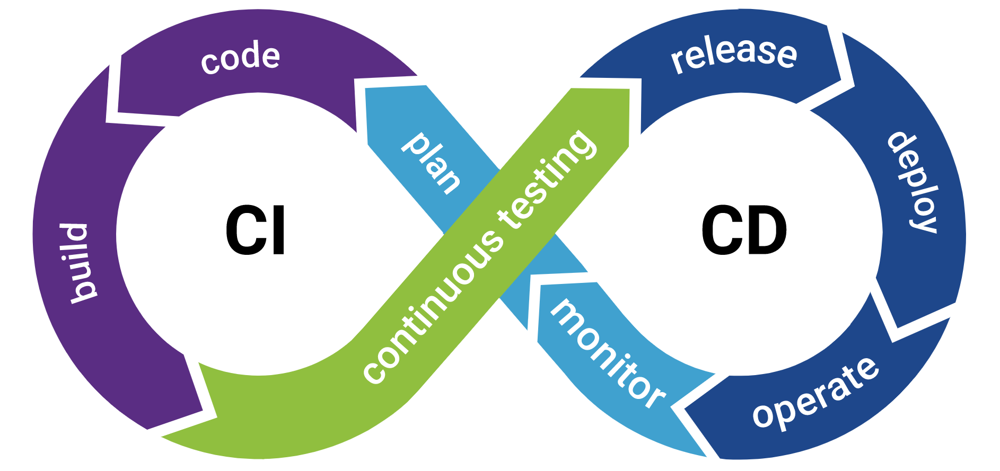
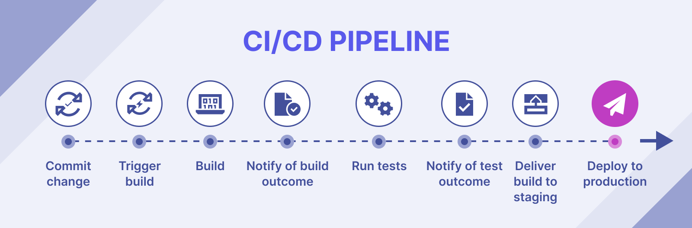
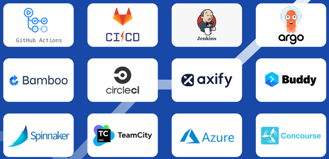

# **CI/CD - GitHub Actions**

Slides voor CI/CD - GitHub Actions workshop van het IT-lab

---

# Meevolgen op:

https://hogent-it-lab.github.io/ci-cd-workshop/slides <!-- URL naar de slides -->

 <!-- QR-code naar de slides -->

---

# Inhoud sessie (in a nutshell)

- Wat is CI/CD? 
- Waarom CI/CD gebruiken?
- Welke tooling bestaat er?
- Praktische toepassing: GitHub Actions

---

# Wat is CI/CD?

- Continuous Integration, Continuous Delivery(/Deployment)
- Code in de codebase wordt automatisch getest, gebouwd en opgezet
- Vaak in verschillende 'omgevingen' (Staging en Production) 
- Name of the game: **pipelines**!!


---

# CI/CD



---

# Waarom CI/CD?

- Automatisatie -> snelheid
- Transparantie en efficiëntie
- Testing!!

---

# DevOps - filosofie en practices

- Silo's van **Dev**elopment en **Op**eration**s** afbreken -> nauwe interactie tussen beide nodig!
- CI/CD staat **centraal** binnen de filosofie van DevOps
- Doel: automatisatie van testen, builden en deployen
- Verhoogde snelheid, frequentie én minder bugs

---

# Pipeline



---

# Pipeline - standaard workflow

- Software builden (afhankelijk van programmeertaal/setting)
- Software testen (bv. syntax checking/linting, unit testen, ...)
- Software deployen
- Elke fase bevat één of meerdere stappen
---

# Tools - overview

<!-- Image van verschillende tools die bestaan -->



---

# Tools - enkele voorbeelden

- **GitHub Actions** - built-in GitHub, goede integratie
- **Jenkins** - open-source, veel opties voor opzetten en configureren
- **GitLab CI/CD** - ~ GitHub Actions, maar dan voor GitLab
- CircleCI - cloud-based optie, ook free tier

---

# GitHub Actions

- CI/CD van GitHub
- Eenvoudig om op te zetten bij GitHub-repositories
- Integreert logischerwijs met heel wat features van GitHub!

---

# Praktische kennismaking - vandaag op het menu

- Praktische toepassing van GitHub Actions!
- Opzetten van GH-repository met basic statische website
- Pipeline: automatisch deployen van website met GitHub Pages

---

# 1. GitHub repository opzetten

- Eigen repository aanmaken via onze [template repository](https://github.com/CrimsonCloak/CI-CD-starter-template)
---

# 2. Repository aanvullen met code (optioneel)

- Customize eventueel statische website (HTML/CSS + JavaScript) (template voorziet al basis)
- Een eigen project of een nieuwe dummy site kan zeker ook gebruikt worden


---

# 3. Pipeline gaan definiëren

- Verschillende stappen:
  - Branch aanmaken op remote repository: `gh-pages`
  - Broncode van de main repo binnenhalen op die branch
  - Branch gaan deployen met GitHub pages
- GitHub Actions: werkt met workflows op basis van `.yml` files!

---

# Voorbeeldsnippet .yml file

```yml
name: "Export and publish slides"
on:
    # Add manual trigger option
    workflow_dispatch:

jobs:
  publish:
    runs-on: ubuntu-latest

    steps:
      - name: Checkout repository
        uses: actions/checkout@v4
```
---

# 3. Pipeline gaan definiëren - mappenstructuur

- Nieuwe directory aanmaken in de repository: `.github`
  - Hierin nog een nieuwe subdirectory maken: `workflows`
  - Hierin komen alle pipeline files voor GitHub Actions!
  - We maken hier een nieuw bestand aan: `deploy.yml`

---

# 3. Pipeline gaan definiëren - workflow file opvullen + push

- Pipeline zal eerst bestaan uit de volgende stappen:
  - 1. GitHub repository binnenhalen
  - 2. GitHub repository gaan deployen via GitHub Pages

---

# 3. Pipeline gaan definiëren - workflow file opvullen + push

<style scoped>
code {
   font-family:  "Times New Roman", Times, serif;
   overflow-y: auto;
   max-height: 400px;
}
</style>

```yml
name: Deploy to GitHub Pages

on:
  push:
    branches:
      - main
  workflow_dispatch:

permissions:
  contents: write

jobs:
  deploy:
    runs-on: ubuntu-latest

    steps:
      - name: Checkout repository
        uses: actions/checkout@v3

      - name: Deploy to GitHub Pages
        uses: peaceiris/actions-gh-pages@v3
        with:
          github_token: ${{ secrets.GITHUB_TOKEN }}
          publish_dir: .
```

---

# 4. Nakijken

- Op de GitHub-repository zal je nu het volgende zien:
  - Nieuwe branch aangemaakt: `gh-pages`
  - Onder het tabblad `Actions` kan je jouw workflows zien
  - Merk op: we kunnen deze workflow nu ook manueel starten via de webinterface.

---

# 5. Koppelen aan GitHub pages

- Laatste stap: GitHub pages configureren via webinterface
  - `gh-pages` branch gebruiken als source
  - De root van deze branch zal als statische content aangeboden worden
  - Even geduld na het instellen...
  - Nu kan je jouw statische website zien via https://<gebruikersnaam>.github.io/<repository-naam>

---

# 6. Extra informatie

- Via GitHub pages kan je dus via het `*.github.io` domein gratis statisch hosten
- MAAR: je kan ook een [eigen domeinnaam koppelen](https://docs.github.com/en/pages/configuring-a-custom-domain-for-your-github-pages-site)!
- Vandaar dat URL bij demo er heel anders uitziet dan bij jullie

---

# Uitbreiding - toevoeging test

- Groot onderdeel van CI/CD: testen!
- We zullen een stap toevoegen aan de workflow: syntax check!
- In dit voorbeeld: basic **linting** van Javascript code

---

# Uitbreiding - nieuwe taak

```yml

 - name: Install ESLint for basic JS syntax check
        run: |
          npm install -g eslint
          eslint script.js

```

---

# Uitbreiding - configuratie van syntax check

- Nieuw bestaand in root van repository: `eslint.config.js`

```
// eslint.config.js
export default [
  {
    files: ["**/*.js"],
    languageOptions: {
      ecmaVersion: "latest",
    },
    rules: {},
  },
];
```

---
# Andere toepassingen

- Testing voor eender welke programmeertaal
- Syntax checking (**linting**) en afdwingen van regels
- Bouwen van documentatie voor een project (denk aan `Javadoc`!)
- Automatisch bouwen van Python of andere packages (**npm**, **PyPi**)
- Software *Dockerizen* via een `Dockerfile` en images naar `Dockerhub`

---

# Héél concreet voorbeeld

- IT-Lab heeft ook een Godot-workshop (game engine)
- Source code kan je op GitHub bijhouden
- Mogelijkheid tot builden van code en hosten op GitHub Pages
- Eventueel koppelen met eigen domeinnaam
- Voorbeeld hiervan is te vinden via volgende [URL](https://knightguy.alexanderveldeman.be/)

---

# The sky is the limit!

- Toepassingen zijn heel breed 
- Veel mogelijkheiden
- Kan jouw (IT-)leven enorm vergemakkelijken