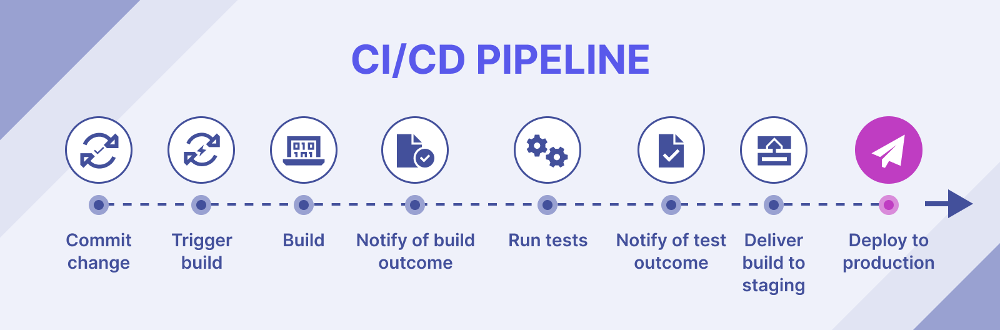

# **CI/CD - GitHub Actions**

Slides voor CI/CD - GitHub Actions workshop van het IT-lab

---

# Github Actions

 <!-- Plaats voor logo voor openingsslide, foefel gerust met de sizes van de bg -->

---

# Meevolgen op:

https://hogent-it-lab.github.io/ci-cd-workshop/slides <!-- URL naar de slides -->

 <!-- QR-code naar de slides -->

---

# Wat is CI/CD?

- Continuous Integration, Continuous Delivery
- Geautomatiseerd integreren van code in de codebase
- Pipelines!
<!--  -->

---

# Pipeline

<!--  -->

---

# Waarom CI/CD?

- Snelheid!
- Automatisatie!
- Transparantie en efficiëntie
- Testing!!

---

# Tools

<!-- Image van verschillende tools die bestaan -->

---


# GitHub Actions

- CI/CD van GitHub
- Eenvoudig om op te zetten bij GitHub-repositories
- Integreert logischerwijs met heel wat features van GitHub

---

# Vandaag op het menu

- Praktische toepassing van GitHub Actions
- Opzetten van repository met basic statische website
- Pipeline: automatisch deployen van website met GitHub Pages

---

# GitHub repository opzetten

---

# Repository aanvullen met code

---

# Pipeline gaan definiëren

- Verschillende stappen oplijsten:
  - Branch op remote repository
  - Broncode van de main repo binnenhalen
  - Branch gaan deployen met GitHub pages
- GitHub Actions: werkt met workflows op basis van `.yml` files!

---

# Pipeline definiëren - yml file

```yml
name: "Export and publish slides"
on:
    # Add manual trigger option
    workflow_dispatch:

jobs:
  publish:
    runs-on: ubuntu-latest

    steps:
      - name: Checkout repository
        uses: actions/checkout@v4
```
---

# GitHub - Actions bekijken